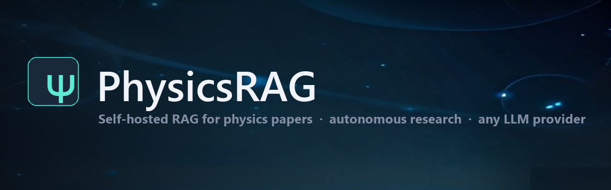
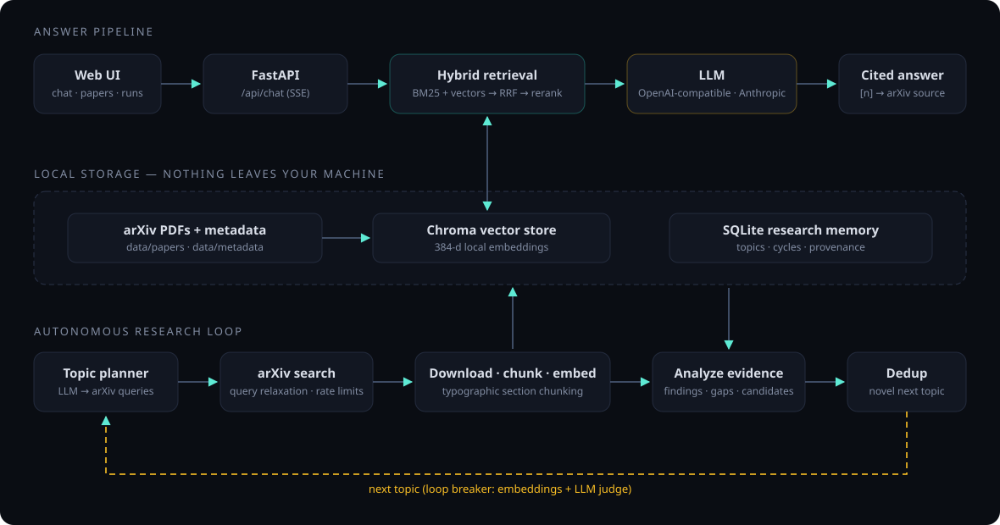

<div align="center">



[](https://github.com/mohammadjafariph/physicsrag/actions/workflows/ci.yml)
[](https://github.com/mohammadjafariph/physicsrag/actions/workflows/docker.yml)


[](LICENSE)

**Self-hosted retrieval-augmented research for physicists.**
An autonomous agent that explores arXiv, builds a searchable paper library,
and answers questions with verifiable citations — with **any** LLM provider.

[Features](#-features) · [Installation](#-installation) · [Providers](#-choose-your-llm-provider) · [Architecture](#-architecture) · [API](#-http-api) · [Config](#-configuration)

</div>

---

## ✦ What is PhysicsRAG?

Give it a physics topic and it runs **autonomous research cycles**: it
plans searches, reads real arXiv papers, extracts what is known and what
is missing, and chooses the next topic to explore — growing a topic tree
you can watch live. Then ask your own questions: answers are generated
*only* from retrieved paper chunks and cite the exact arXiv paper,
section, and page behind every claim.

Everything runs on **your machine**: papers, embeddings, vector store, and
research memory are local files. The only external calls are arXiv itself
and whichever LLM API you configure.

## ✦ Features

- **🔬 Autonomous research loop** — plan → search → download → chunk →
  embed → analyze → dedup → next topic, persisted end-to-end with
  provenance (every finding cites real chunk IDs)
- **💬 Cited answers** — streaming RAG chat where `[n]` citations link to
  the exact paper section; the model is instructed to refuse when evidence
  is insufficient, and fake citations are impossible by construction
- **🔌 Any LLM provider** — one config switch: Groq, OpenAI, Anthropic,
  OpenRouter, DeepSeek, Mistral, xAI, Together, or fully local via
  Ollama / LM Studio / vLLM. Embeddings and reranking always run locally
- **🧠 Anti-loop memory** — topic deduplication via acronyms, substring
  matching, embeddings, and an LLM judge, so the agent explores instead
  of circling
- **🖥 Zero-build web UI** — dark lab-themed SPA with live run logs, topic
  tree, paper library, and KaTeX math rendering (vendored, works offline)
- **🐳 Production-ready** — FastAPI + SSE, pytest suite, Docker, CI, and
  GHCR image publishing out of the box

## 🚀 Installation

Requires **Python 3.11+** — check with `python --version` (Windows) or
`python3 --version` (macOS/Linux). All heavy deps (PyMuPDF, torch,
sentence-transformers) ship as prebuilt wheels on all three platforms —
no extra system packages needed.

### Windows (PowerShell)

```powershell
git clone https://github.com/mohammadjafariph/physicsrag
cd physicsrag
python -m venv .venv
.venv\Scripts\activate
pip install -r requirements.txt
copy .env.example .env        # then set LLM_PROVIDER + LLM_API_KEY
uvicorn src.api.server:app
# open http://127.0.0.1:8000
```

### macOS

```bash
# if your python3 is older than 3.11: brew install python@3.11
git clone https://github.com/mohammadjafariph/physicsrag
cd physicsrag
python3 -m venv .venv
source .venv/bin/activate
pip install -r requirements.txt
cp .env.example .env          # then set LLM_PROVIDER + LLM_API_KEY
python3 -m uvicorn src.api.server:app
# open http://127.0.0.1:8000
```

### Linux (Debian/Ubuntu)

```bash
sudo apt update && sudo apt install -y python3 python3-venv python3-pip git
git clone https://github.com/mohammadjafariph/physicsrag
cd physicsrag
python3 -m venv .venv
source .venv/bin/activate
pip install -r requirements.txt
cp .env.example .env          # then set LLM_PROVIDER + LLM_API_KEY
python3 -m uvicorn src.api.server:app
# open http://127.0.0.1:8000
```

> **Note** — if the `uvicorn` command isn't found even inside an activated
> venv, use the venv's interpreter directly:
> `.venv\Scripts\python -m uvicorn src.api.server:app` (Windows) or
> `.venv/bin/python -m uvicorn src.api.server:app` (macOS/Linux).

### Or with Docker

```bash
cp .env.example .env    # set your provider + key
docker run -p 8000:8000 -v physicsrag-data:/app/data --env-file .env \
  ghcr.io/mohammadjafariph/physicsrag:latest
# or: docker compose up --build
```

> **Tip** — fully local, zero-API setup: install [Ollama](https://ollama.com),
> `ollama pull llama3.1:8b`, then set `LLM_PROVIDER=ollama`. No key needed.

The original CLI pipeline still works: `python main.py 3 "Open quantum systems"`

## 🔌 Choose your LLM provider

Everything is driven by `.env` — or switch live in the web UI's Settings
page (persisted back to `.env`; the key never leaves the server):

| Provider    | Base URL (preset)                | Example model            |
|-------------|----------------------------------|--------------------------|
| `groq`      | `https://api.groq.com/openai/v1` | `openai/gpt-oss-120b`    |
| `openai`    | `https://api.openai.com/v1`      | `gpt-4o-mini`            |
| `anthropic` | `https://api.anthropic.com`      | `claude-sonnet-4-5`      |
| `openrouter`| `https://openrouter.ai/api/v1`   | any OpenRouter model     |
| `deepseek`  | `https://api.deepseek.com/v1`    | `deepseek-chat`          |
| `mistral`   | `https://api.mistral.ai/v1`      | `mistral-large-latest`   |
| `together`  | `https://api.together.xyz/v1`    | `meta-llama/...`         |
| `xai`       | `https://api.x.ai/v1`            | `grok-3`                 |
| `ollama`    | `http://localhost:11434/v1`      | `llama3.1:8b` (local)    |
| `lmstudio`  | `http://localhost:1234/v1`       | loaded model (local)     |
| `vllm`      | `http://localhost:8001/v1`       | served model (local)     |
| `custom`    | set `LLM_BASE_URL`               | any OpenAI-compatible    |

Legacy compatibility: `GROQ_KEY` still works when `LLM_PROVIDER=groq`.

Mix models per stage with `PLANNER_MODEL` / `ANALYZER_MODEL` /
`DEDUP_MODEL` — e.g. a cheap local model for planning, a strong one for
analysis. Embeddings and reranking always run locally
(sentence-transformers), so your paper library never leaves your machine.

## 🏗 Architecture

<div align="center">

</div>

**How answers stay honest:**

- chunks keep paper/section/page provenance end-to-end
- findings may only cite chunk IDs that were actually retrieved; paper
  IDs are derived from chunk-ID prefixes, never trusted from the LLM
- the chat prompt forbids answers beyond the evidence, and the UI only
  maps `[n]` markers to genuinely retrieved chunks

**How the loop avoids circling:** candidate next topics pass a three-layer
filter — acronym/substring prefilter, embedding similarity, then an LLM
judge for paraphrases — breaking loops like *MIPT → quantum measurement → MIPT*.

## 🌐 The web UI (`http://127.0.0.1:8000`)

- **Ask the library** — streaming answers with KaTeX-rendered math
  (`$...$`, `$$...$$`, `\(...\)`, `\(...\)` — vendored, works offline)
  and clickable `[n]` source cards (arXiv paper, section, page)
- **Papers** — every downloaded paper: authors, categories, chunk counts,
  arXiv links, instant client-side filtering
- **Research runs** — start a multi-cycle exploration, watch the pipeline
  log stream live, and see the topic tree grow
- **Settings** — switch provider/model at runtime, no restart

## 🔌 HTTP API

| Method     | Path                        | Purpose                                       |
|------------|-----------------------------|-----------------------------------------------|
| `GET`      | `/api/health`               | status + library counts + provider            |
| `GET`      | `/api/papers[/{id}]`        | paper library / one paper's metadata          |
| `GET`      | `/api/topics[/tree]`        | topics + cycle history / research trajectory  |
| `POST`     | `/api/chat`                 | RAG answer with citations (JSON)              |
| `POST`     | `/api/chat/stream`          | same, as SSE (`citations` → `token` → `done`) |
| `POST`     | `/api/research/runs`        | start a background research run               |
| `GET`      | `/api/research/runs[/{id}]` | run status, live log, tree                    |
| `GET/POST` | `/api/settings`             | inspect / switch provider at runtime          |

```bash
curl -X POST http://127.0.0.1:8000/api/chat \
  -H "Content-Type: application/json" \
  -d '{"question": "How does entanglement entropy scale at the critical point?"}'
```

## ⚙️ Configuration

| Variable                                       | Default                                | Meaning                      |
|------------------------------------------------|----------------------------------------|------------------------------|
| `LLM_PROVIDER`                                 | `groq`                                 | provider preset name         |
| `LLM_MODEL`                                    | `openai/gpt-oss-120b`                  | default model for all stages |
| `LLM_API_KEY` / `LLM_BASE_URL`                 | –                                      | key / endpoint override      |
| `PLANNER_MODEL` `ANALYZER_MODEL` `DEDUP_MODEL` | (`LLM_MODEL`)                          | per-stage overrides          |
| `EMBEDDING_MODEL`                              | `all-MiniLM-L6-v2`                     | local sentence-transformer   |
| `RERANKER_MODEL`                               | `cross-encoder/ms-marco-MiniLM-L-6-v2` | local cross-encoder          |
| `RETRIEVAL_K`                                  | `8`                                    | evidence chunks per question |
| `DATA_DIR`                                     | `./data`                               | papers, vectors, SQLite      |


## 🧪 Tests

```bash
python -m pytest    # 82 tests: config, providers, chunker, ranking,
                    # memory/dedup, citations, network-failure safety
```

## ✍️ Authorship

The idea, design, and architecture of this project — the research-loop
concept, the anti-loop memory, the citation-provenance strategy, and the
overall product — are my own work. The implementation was written with
the assistance of LLM-based coding agents, with me directing every design
decision, reviewing each change, and running the verification.

## 📄 License

[MIT](LICENSE) — © 2026 Mohmmad Jafari

<div align="center">
<sub>Built for physicists who want their literature search accountable — every claim traceable to a page.</sub>
</div>